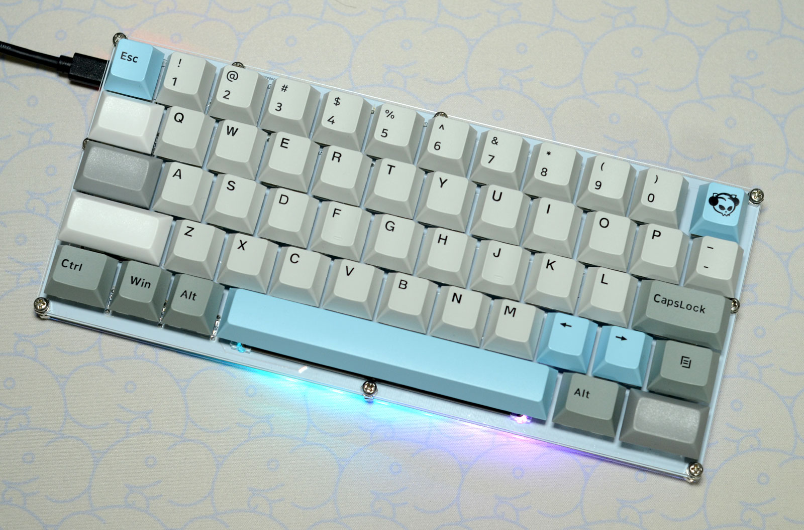

# RowLow52

## What is RowLow52?

ロウスタッガード配列の52キーを有するキーボードです。  
This is a row-staggered 52-key keyboard.
 
ロウ(Row)スタッガードで、ロー(Low)センシ向けのキーボードなのでRowLow52と名付けました。
I named it RowLow52 because it is a row staggered keyboard for low sensitivity.

 
 

## Build Guide  
V2   https://note.com/sam1dare/n/nca3b63fb6e3b
V1.1 https://note.com/sam1dare/n/nf6a3704ffbe0  
(Japanese text only.)  

 

## License  
このプロジェクトは MITライセンスに基づいてライセンスされています。詳細については、LICENSE.txt ファイルを参照してください。  
This project is licensed under the MIT License, see the LICENSE.txt file for details.
